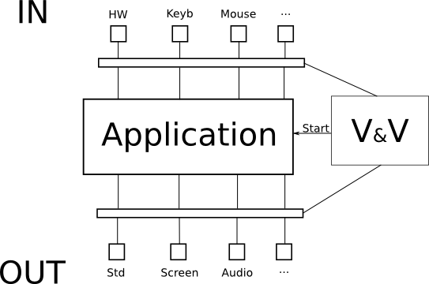

Description
---

Vev is a software that will allow to start running other software while controlling its inputs and outputs. That will allow to use inputs and outputs of an other equipment with eventually an other operating system.

Requirements
---

VeV shall work as client ans as server.

It shall run on two equipments connected A and B.

It shall be able to manage the display on A and B's screens.

It shall be interfaced with the system's inputs and outputs.

It shall start an application and manage its inputs and output.

It shall allow a secured communication between A and B.

It shall send/receive application data between A and B.

